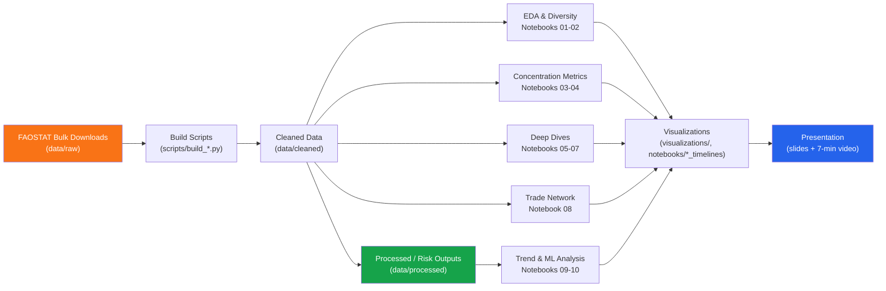

<p align="center">
  
  
  
  
  
</p>

<p align="center">
  <b>Track:</b> Trade &nbsp;|&nbsp; <b>Team:</b> FoodMatrix &nbsp;|&nbsp; <b>Submission:</b> Sep 15, 2026
</p>

---

## 📌 About the Project

**FoodMatrix** measures how structurally exposed countries are to a disruption in their staple cereal trade — wheat, rice, maize, soya, and barley — using two decades (2005–2024) of [FAOSTAT](https://www.fao.org/faostat/en/#data) bilateral trade data.

Rather than just asking *"who trades with whom"*, we built a **risk index** combining supplier concentration (HHI), diversification (Shannon evenness), and network centrality — then stress-tested it against a real shock (the 2023 India rice export ban) and used ML to see whether the drivers are stable over time.

---

## 🔑 Key Findings

- **Hidden corridors:** Uzbekistan sources 99.2% of its wheat from Kazakhstan and Tajikistan — but Kazakhstan itself imports 99.9% of *its* wheat from Russia. Four countries and ~5 Mt/yr sit behind one dependency chain that simple supplier-share metrics miss entirely.
- **Egypt got riskier, not safer, after 2022** — partner HHI rose 0.33 → 0.50, with Russia's share of Egyptian wheat imports climbing 47% → 69%.
- **Concentration measures exposure, not outcome.** Tested against the 2023 India rice ban: Ethiopia's imports fell 69%, Indonesia's rose 651%. Our index flags *who's exposed*, not *what happens next* — and we say so explicitly rather than overclaim.
- **The "rising global risk" trend is partly a mirage.** Full-sample risk scores climb from 0.276 → 0.320 (2005–2024), but the *balanced panel* of 27 countries present throughout stays nearly flat (0.251 → 0.263). Most of the apparent increase is new, higher-risk countries entering the sample — not existing countries getting riskier.
- **Kazakhstan is the biggest single mover** — risk score 0.09 → 0.66 — and the most volatile country in the panel.
- **ML validates the index, doesn't just fit it.** XGBoost regression on real merged data reaches R² = 0.67; risk-level classification hits 73.5% accuracy, with `self_sufficiency_ratio` and `partner_hhi` as the top features — independently confirming the two components the index is built on.
- **Mirror-trade check:** partner-reported ("mirror") export data recovers only ~66% of self-reported volume on average (75% for 2017–21) — reliable for shares/rankings, not for absolute tonnage claims.

---

## 🏗️ Architecture / Data Pipeline



---

## 📂 Repository Structure

```
FoodMatrix_Datathon/
│
├── README.md                  # This file
├── CONTRIBUTING.md            # Team workflow guidelines
├── LICENSE                    # MIT License
├── requirements.txt           # Python dependencies
├── .gitignore
│
├── config/
│   └── faostat.json           # Commodity/item-code mappings (fbs_item_map, etc.)
│
├── data/
│   ├── raw/                   # Original FAOSTAT bulk downloads (gitignored, large)
│   ├── cleaned/                # Cleaned trade/price/FBS datasets
│   ├── processed/              # Risk scores, predictions, concentration outputs
│   ├── samples/                # Small committed samples (e.g. country_risk_top40.csv)
│   ├── metadata/               # Dataset metadata, checksums, quality reports
│   └── README.md               # Data dictionary & mirror-export methodology notes
│
├── scripts/
│   ├── build_faostat_dataset.py
│   ├── build_fbs_dataset.py
│   ├── build_mirror_exports.py
│   ├── build_quantity_concentration.py
│   ├── calculate_risk.py
│   ├── download_faostat.py
│   ├── final_clean_raw_data.py
│   ├── partner_concentration.sql
│   └── rasheed/                # Practical-application figures & first-cut exposure script
│
├── notebooks/
│   ├── 01_eda.ipynb
│   ├── 02_shannon_diversity_and_eda.ipynb
│   ├── 03_concentration_metric_correlation.ipynb
│   ├── 04_idr_vs_concentration_quadrant.ipynb
│   ├── 05_rice_deep_dive.ipynb
│   ├── 06_producer_price_validation.ipynb
│   ├── 07_supplier_removal_simulation.ipynb
│   ├── 08_global_trade_network_analysis.ipynb
│   ├── 09_trend_analysis.ipynb
│   ├── 10_predictive_ml_analysis.ipynb
│   ├── historical_timelines/   # Per-commodity network & PageRank charts
│   ├── risk_trend_charts/      # Trend & ML output charts
│   └── README.md               # Trade-network methodology (HHI, PageRank) & findings
│
├── docs/
│   ├── meeting_notes.md
│   └── rasheed/                 # Research question, methodology spec, risk index design,
│                                  data audit, practical-application writeup
│
├── visualizations/               # Cross-notebook exported charts for the deck/video
│
└── presentation/                 # Final slides + video (gitignored large media)
```

> 📓 **Notebook numbers above reflect the analysis flow** (EDA → concentration → deep dives → network → trend/ML). See [Renumbering](#-housekeeping-before-submission) below to apply this.

---

## 🧭 Notebook Guide

| # | Notebook | What it covers |
|---|---|---|
| 01 | `eda.ipynb` | Initial exploration of the cleaned FAOSTAT trade matrix |
| 02 | `shannon_diversity_and_eda.ipynb` | Shannon evenness / diversity of supplier bases |
| 03 | `concentration_metric_correlation.ipynb` | How HHI, Shannon, and IDR relate to each other |
| 04 | `idr_vs_concentration_quadrant.ipynb` | Import-dependence vs. concentration quadrant analysis |
| 05 | `rice_deep_dive.ipynb` | Rice-specific concentration & the 2023 India ban spotlight |
| 06 | `producer_price_validation.ipynb` | Validating risk scores against producer price spikes |
| 07 | `supplier_removal_simulation.ipynb` | Cascading-impact simulation of removing a top supplier |
| 08 | `global_trade_network_analysis.ipynb` | HHI, trade-network structure & reversed-PageRank centrality across 5 commodities |
| 09 | `trend_analysis.ipynb` | Full-sample vs. balanced-panel risk trend, biggest movers |
| 10 | `predictive_ml_analysis.ipynb` | XGBoost regression + classification validating the index |

---

## ⚙️ Getting Started

```bash
git clone https://github.com/Kanakbaghel/FoodMatrix_Datathon.git
cd FoodMatrix_Datathon

python -m venv venv
source venv/bin/activate      # Mac/Linux
venv\Scripts\activate         # Windows

pip install -r requirements.txt
```

Run notebooks in numeric order (01 → 10) — later notebooks depend on outputs written to `data/cleaned/` and `data/processed/` by the scripts and earlier notebooks.

See [CONTRIBUTING.md](CONTRIBUTING.md) for branching & PR workflow.

---

## ⚠️ Data Caveats

- **Mirror-export data recovers ~66% of self-reported volume on average** (75% for 2017–21) — sound for shares/rankings, not for absolute tonnage figures.
- **2024 is the thinnest year in the panel** (42 partner reports for Russian wheat vs. 81 in 2021) — treat the most recent year's numbers as provisional.
- **The risk index measures exposure, not predicted outcome** — validated against the 2023 India rice ban, where country-level responses varied by over 700 percentage points.

---

## 📄 License

MIT — see [LICENSE](LICENSE).

## 🙏 Acknowledgements

- [Women in Data](https://www.womenindata.org/) for organizing the Datathon 2026
- [FAOSTAT](https://www.fao.org/faostat/en/#data) for open access to global food and agriculture data


