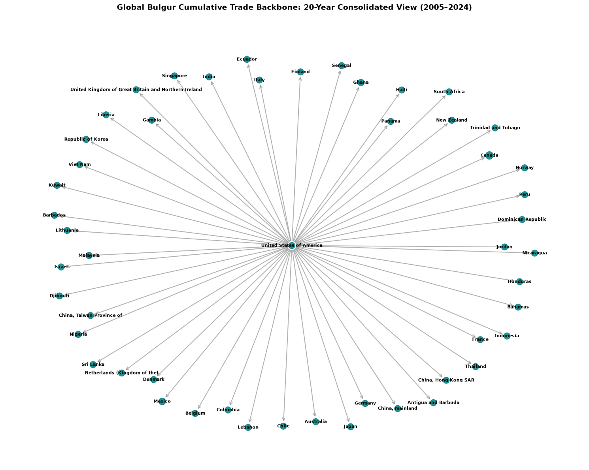
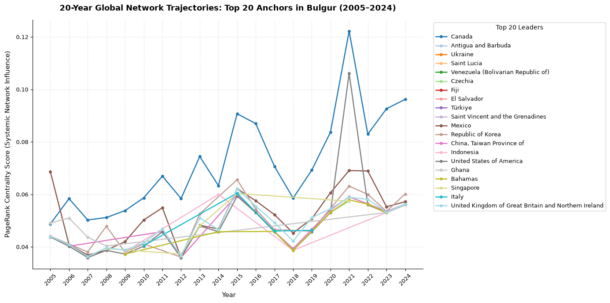
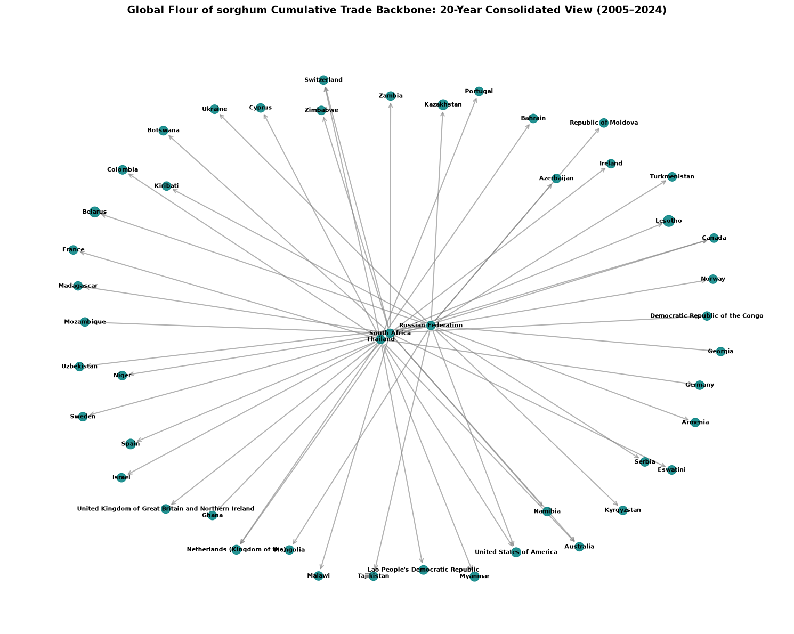
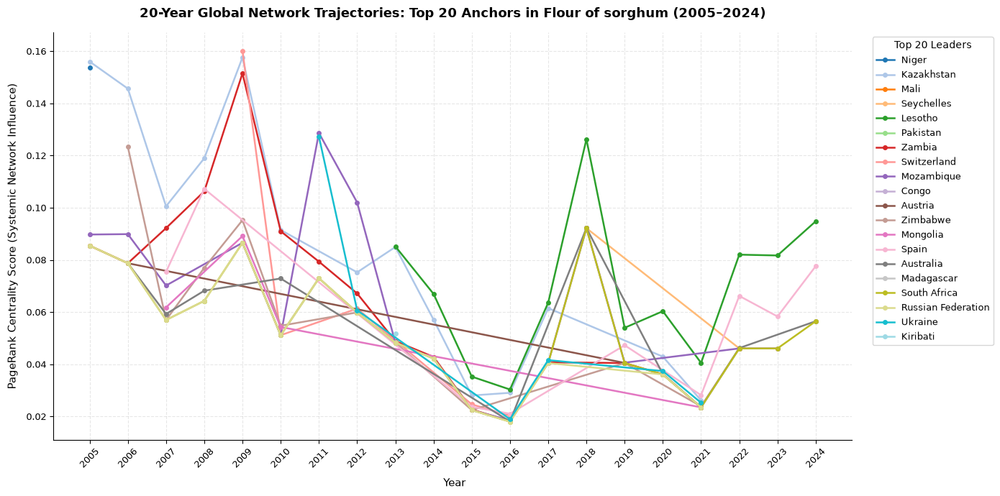
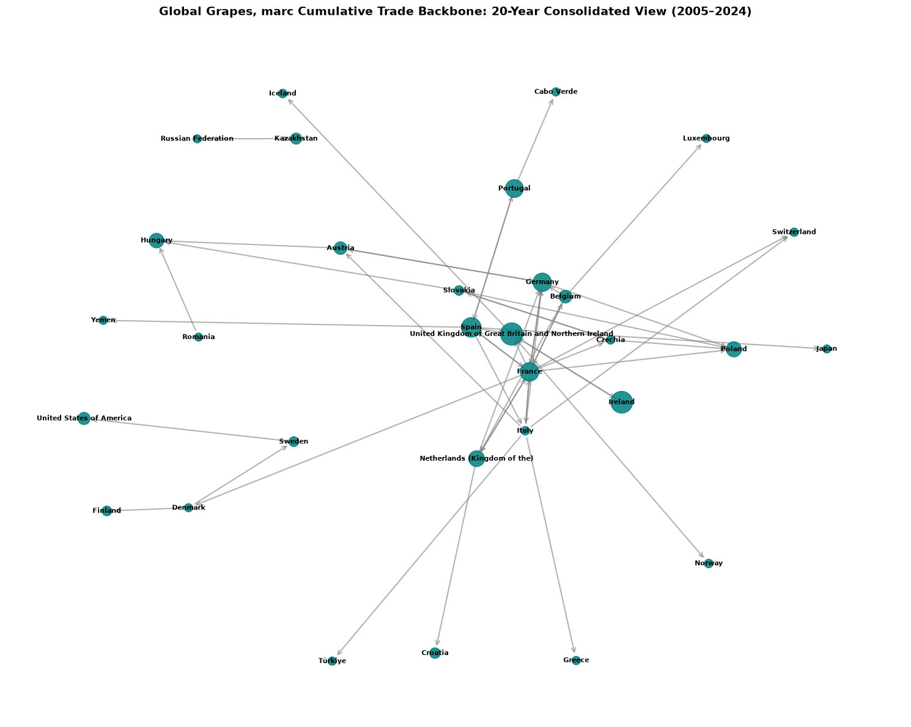
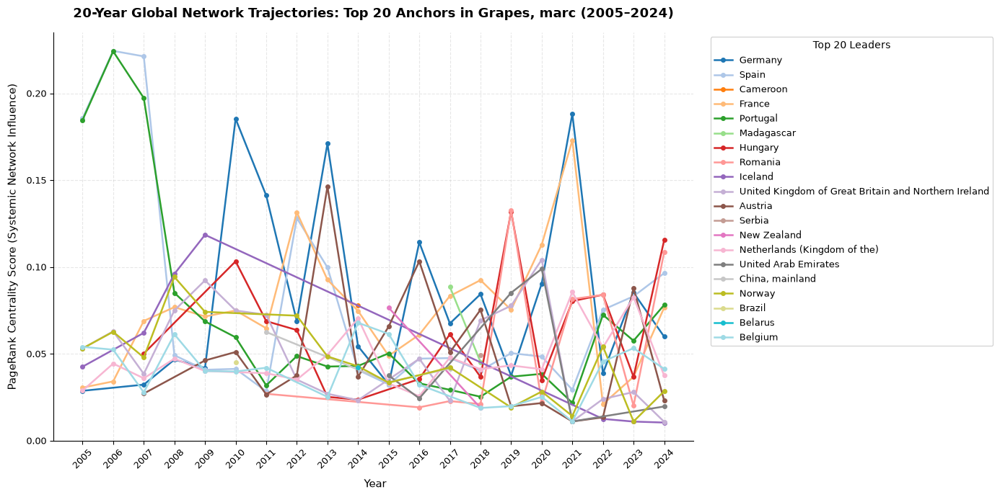
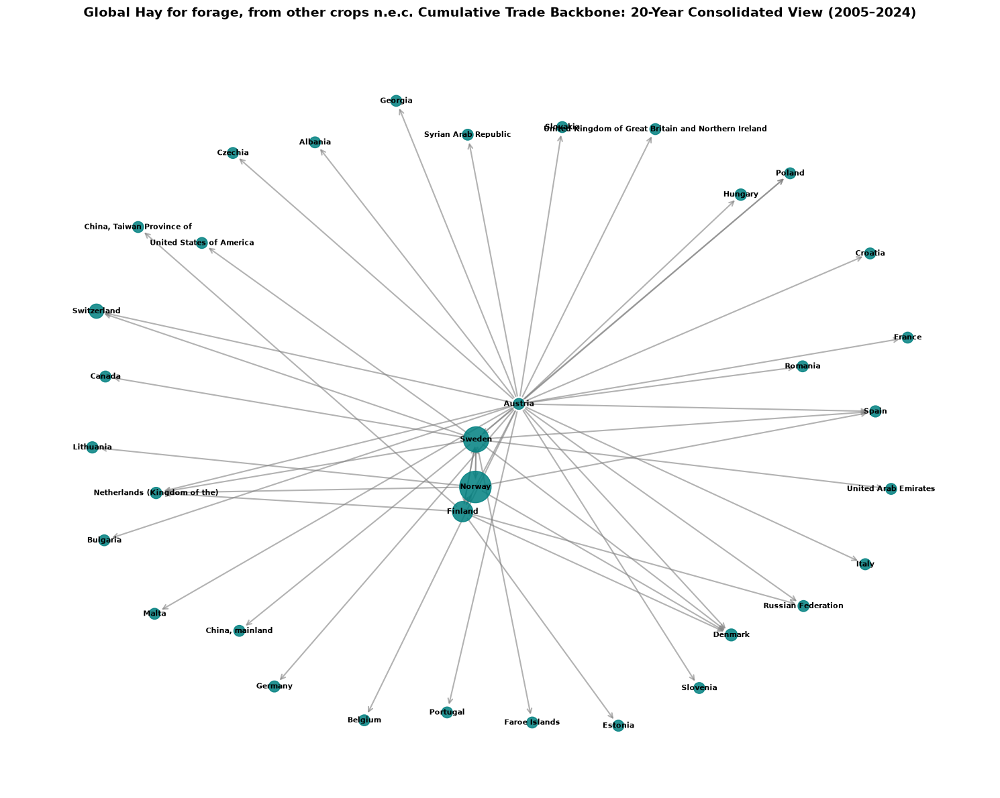
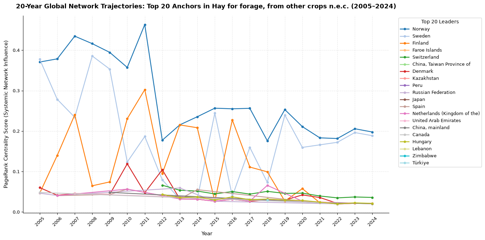
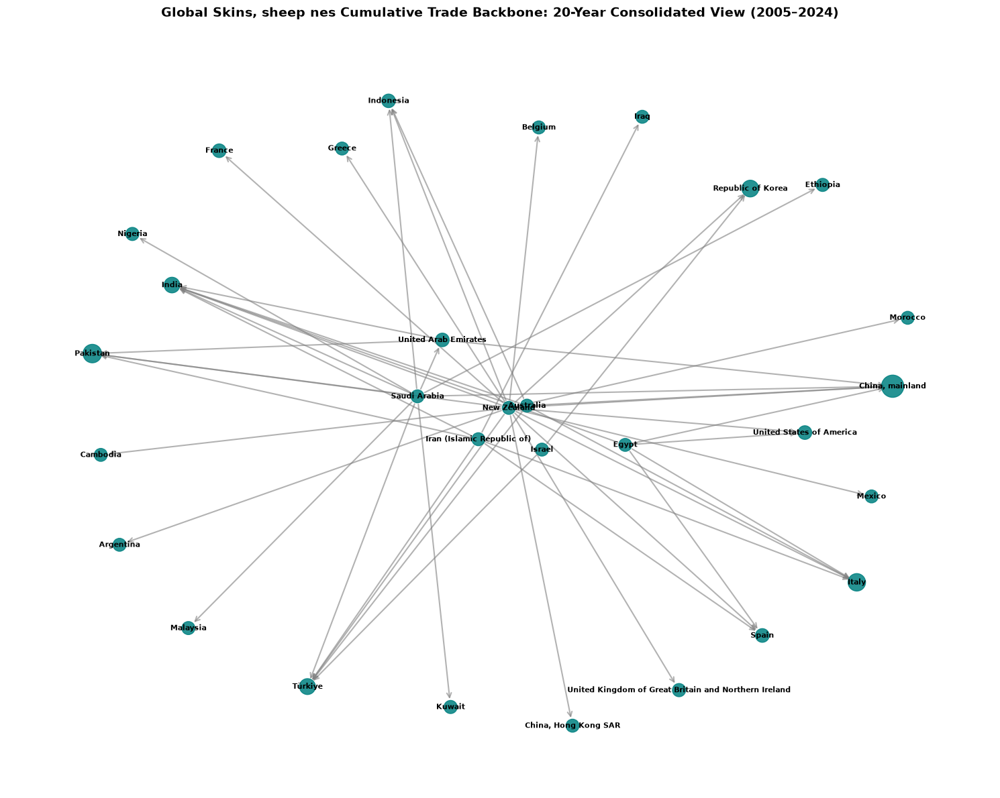
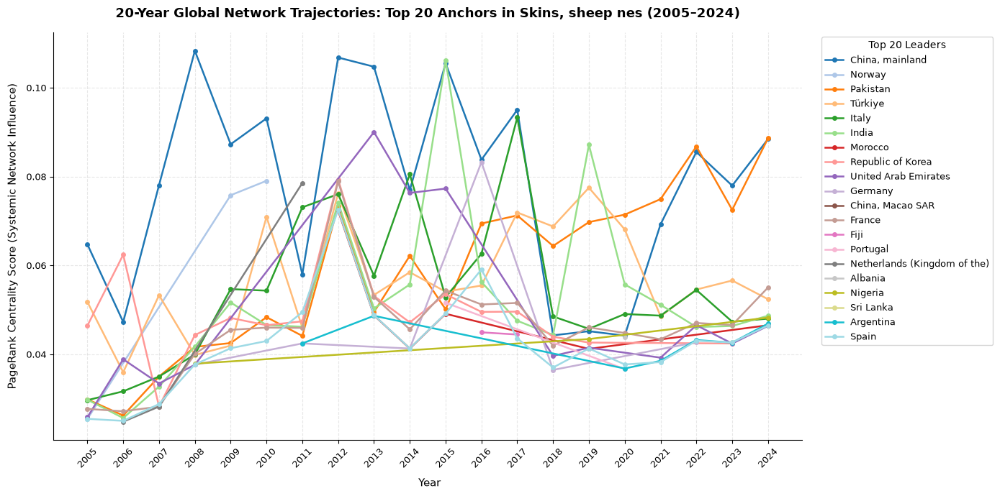

# Trade Network Analysis

## To understand how each commodity moves through the global market, we looked at the trade network from two different perspectives:
### NetworkX shows the structure of the market, which countries trade with each other and which countries have the most direct connections.
### PageRank looks at influence within that structure. It considers not only how many trading relationships a country has, but also how important the countries on the other end of those relationships are.

## This distinction matters because the country with the most connections is not always the country with the greatest influence over the wider network. Looking at both measures gives us a clearer picture of how trade is organised and how that balance changes over time.

# 1. Bulgur Trade Network:

### The Bulgur network shows a clear difference between being well connected and being influential within the wider system.

## What the trade network shows:

### The network has a strong pattern. A small number of countries sit near the centre of the market, while many others connect to them rather than trading extensively with one another.
### The United States stands out as the main hub when we look at direct trading relationships. It has the largest number of incoming and outgoing connections, making it the most visibly connected country in the network.
### At the edges of the network, countries such as the Republic of Korea, Liberia and Malaysia have far fewer direct connections. Their trade relationships are more limited and concentrated around a smaller number of partners.

## What PageRank shows:

### PageRank changes the picture slightly, Although the United States remains the most obvious physical hub, Canada became particularly important around 2021, reaching a PageRank of approximately 0.12. This suggests that Canada’s importance at that time was not simply a result of having many trading partners. It was also connected to countries that themselves played important roles in the wider Bulgur market.
### The results also show that influence within the network did not remain fixed. Countries such as Antigua and Barbuda, Türkiye and the United Kingdom became more important at different points during the period studied.
## Why this matters?

### 1 The key finding is that the biggest hub is not necessarily the most important country at every point in time.
### 2 The United States consistently appears as the main centre of Bulgur trade, but the PageRank results show that Canada’s position became particularly important around 2021.
### 3 This gives us a more useful picture of the market, trade influence can move from one country to another when market conditions change.

# 2. Flour of Sorghum Network:

The Sorghum flour network tells a very different story. Instead of one country consistently dominating the network, the important trading positions shift considerably over time.

## What the trade network shows:

### The network contains several strong regional centres, particularly around the Russian Federation, South Africa and Thailand. From these centres, trade routes spread towards markets around the world. However, many of these connections are relatively long and isolated, reaching countries such as Colombia, Uzbekistan and Madagascar. This creates a network that is less tightly connected than the Bulgur market. Trade exists across many countries, but the relationships between those countries are not equally strong.

## What PageRank shows:

### The PageRank results reveal just how much this market has changed over time, between 2005 and 2012, countries such as Niger and Mali reached PageRank levels close to 0.15, placing them among the most influential countries in the network during that period. Their influence later declined significantly.
### After 2016, the market became much more spread out. No individual country consistently reached more than approximately 0.08 PageRank, In practical terms, there was no longer one clear country at the centre of the global Sorghum flour network.

## Why this matters?

### 1 This is one of the clearest examples of why looking only at the number of trade connections would not be enough.
### 2 NetworkX shows us where the regional trading groups are, while PageRank shows us how the importance of those groups changed over time.
### 3 The result is a market that moved from strong African regional centres towards a much more distributed global network.
### 4 For food security and supply planning, this matters because a market without one dominant centre may be less dependent on a single country, but it can also be harder to predict when major trading relationships change.

# 3. Grapes, Marc Network:

The Grapes, Marc network is strongly centred around Europe, but unlike a simple hub-and-spoke system, several European countries play important roles at the same time.

## What the trade network shows:

### The network forms a dense group of connections between Germany, France, Spain, Italy, Belgium and the Netherlands. These countries trade directly with one another, creating a closely connected European market rather than relying on one single country.
### There are also trade routes extending beyond this European core to countries such as Kazakhstan, Iceland, Cabo Verde and the Russian Federation. These markets are often connected through larger European trading countries, including Austria and Portugal. Because many of the major European traders are directly connected to each other, the network has several alternative routes through which trade can move. This means the market is not dependent on one single trading relationship.

## What PageRank shows:

### The PageRank results show that the balance of influence has changed considerably over time, between 2005 and 2007, Spain and Portugal were particularly influential, with PageRank values rising above 0.22, their importance later became less concentrated as other European countries became more prominent.
### Germany shows the strongest recurring increases in influence later in the period. Its PageRank reached approximately 0.18–0.19 in 2010, 2013 and 2022, indicating periods when Germany became an especially important point in the global trade network.
### Other countries, including France, Cameroon and Hungary, also become important at different points, their changing positions suggest that influence can move between countries when trade patterns and supply routes change.

## Why this matters?
### 1 The Grapes, Marc network shows that a highly connected market can still experience major changes in where influence is concentrated.
### 2 The European market has a strong network of alternative trading relationships, which gives it a degree of flexibility. However, PageRank shows that the countries carrying the most influence are not fixed.
### 3 The story therefore moves from strong Spanish and Portuguese influence in the mid-2000s to repeated periods of increased German influence, particularly in years when Germany became a more important point within the trade network.
### 4 This is an important distinction because the network remains connected, but the countries with the greatest influence within that network can change.

# 4. Hay for Forage Network:

The Hay for Forage network is much more concentrated than the Sorghum flour network. Here, Europe clearly sits at the centre of global trade.

## What the trade network shows:
### The network contains a closely connected European core, with countries such as Austria, Sweden, Norway and Finland forming strong links with one another and with markets outside Europe.
### Further away from this core are countries such as the United Arab Emirates, Syrian Arab Republic and Japan, which appear more dependent on connections with the major European trading countries.
### The structure therefore looks less like a collection of separate markets and more like a central European network supplying a wider group of destinations.

## What PageRank shows:

### PageRank makes the concentration even clearer.
### Norway consistently appears as the most influential country in the network, with PageRank reaching approximately 0.35–0.45 over the period studied.
### Sweden is the next major player, with scores generally around 0.20–0.30.
### The gap between these countries and most of the rest of the network is substantial.

## Why this matters?

### 1 The important finding here is not simply that several European countries export hay, It is that a large share of the network’s importance is concentrated in a small number of countries, particularly Norway.
### 2 That concentration creates both strength and risk. Strong central suppliers can make a network efficient under normal conditions. At the same time, a major disruption affecting one of these countries could have consequences far beyond its own domestic market.
### 3 This makes Hay for Forage a strong example of how a country’s position in a trade network can give it influence well beyond the size of its own market.

# 5. Sheep Skins — Raw Leather Trade: 

The Sheep Skins network is also different, Rather than having one dominant centre, it is made up of several important regional trading and processing hubs.

## What the trade network shows:

### The network is highly interconnected, with major roles played by countries including the United Arab Emirates, Saudi Arabia, New Zealand, Italy and China.
### The large number of crossing trade routes suggests that sheep skins do not simply move directly from a producer to a final buyer. In many cases, they pass through several countries involved in processing, trading or manufacturing.

## What PageRank shows:

### PageRank reveals that the importance of individual countries changes in cycles.
### China, for example, experienced notable increases in network influence, with its PageRank rising above 0.10 in 2008, 2012 and 2015.
### Other countries, including Pakistan, Türkiye and India, also become more important at different stages.
### This pattern suggests that changes in the network are closely connected to where processing capacity and manufacturing demand are strongest at a particular time.

## Why this matters?
### 1 The main lesson from the Sheep Skins network is that raw materials and manufacturing are closely connected.
### 2 NetworkX shows us the complicated web of countries through which sheep skins move, PageRank helps explain why that web changes over time.
### 3 The influence shifts between countries involved in supplying raw materials and those with strong processing or manufacturing industries.
### 4 This means that changes in manufacturing demand can affect the trade network far beyond the country where that demand originates.

# Overall Findings:

#### When the five commodities are viewed together, the analysis shows that global trade is not simply about who exports the most or who has the largest number of trading partners. The position of a country within the wider network matters just as much.
#### The five networks demonstrate five different patterns:

### 1 Bulgur shows that the most connected country is not necessarily the most influential at every point in time. The United States remains the main hub, while Canada became particularly important around 2021.

### 2 Sorghum flour shows how influence can move away from a small number of regional leaders and become spread across a wider group of countries.

### 3 Grapes, Marc shows that even a well connected and relatively resilient market can experience significant changes in which countries hold the greatest influence.

### 4 Hay for Forage shows what happens when influence becomes heavily concentrated, with Norway occupying a particularly important position in the network.

### 5 Sheep Skins shows the connection between raw-material suppliers, processing centres and manufacturing demand, with influence moving between countries as those relationships change.

## The main insight from this analysis are:
### 1 Trade is not just about volume, It is about position, connections and dependence.
### 2 NetworkX allows us to see how the trade is connected while PageRank allows us to see which countries matter most within those connections. When we combine the two, we can identify countries that may not look important from trade volume alone but play a critical role in keeping the wider network connected. That is where this analysis becomes useful beyond the charts, It can help identify where supply chains are concentrated, where a disruption could have wider consequences, and where stronger trade relationships could reduce dependence on a small number of markets.
### 3 In other words, we are not just showing where commodities move. We are showing how the structure of global trade can create both resilience and vulnerability and which countries sit at the points where those effects are felt most strongly.

