# Global Agricultural Trade Network Analysis 2005–2024

## Overview

This contains analysis of global agricultural trade networks
across five major staple commodities: wheat, maize (corn), rice,
soya beans, and barley.

The analysis focuses on identifying patterns of exporter concentration,
trade-network structure, and systemic supplier importance over the
2005–2024 period.

## Research Focus

The analysis addresses three main questions:

1. How concentrated is global export supply for each commodity?
2. Which countries occupy the most important positions within the
   global trade networks?
3. Which suppliers could have the greatest systemic importance if
   disruptions affected international trade?

## Analytical Approach

### 1. Market Concentration — HHI

The Herfindahl-Hirschman Index (HHI) is used to measure the
concentration of export supply for each commodity.

Higher values indicate that exports are concentrated among fewer
countries, while lower values indicate a more diversified supplier
base.

### 2. Trade Network Structure

The analysis constructs cumulative trade networks for 2005–2024
and identifies the 50 strongest bilateral export links for each
commodity.

Node size represents the number of active bilateral trade
connections, while directed edges represent the direction of
export flows.

### 3. Systemic Supplier Centrality

Reversed PageRank is used to measure the systemic importance of
exporting countries.

By reversing the direction of trade links, the measure captures
supplier importance based on the dependence of connected
importing markets rather than simply the volume exported.

# Key Findings:

# Overall Market Concentration (HHI Across Staples)

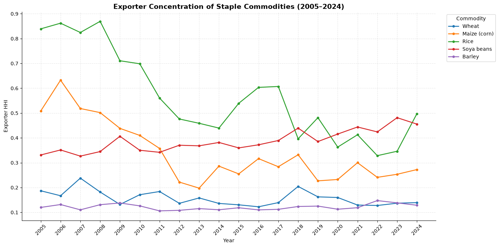

## Exporter Market Concentration (2005–2024)

The Herfindahl-Hirschman Index (HHI) is used to compare how concentrated export supply is across the five staple commodities over the 2005–2024 period. Higher HHI values indicate that exports are concentrated among fewer countries, while lower values point to a more diversified supplier base. In this analysis, values above 0.25 are treated as relatively high concentration, whereas values below 0.15 indicate a more diversified market.

1. Rice, Highest and Most Variable Concentration: Rice records the highest HHI values for much of the study period, with concentration reaching above 0.85 at its peak before settling in the 0.35–0.60 range. This suggests a strong dependence on a relatively small number of exporters, leaving the market more exposed to export restrictions, production losses, or other disruptions affecting major Asian suppliers.

2. Soya Beans, Increasing Concentration: Soya beans show a clear upward trend in concentration, with HHI rising from approximately 0.33 in 2005 to almost 0.50 in 2024. The pattern points to a growing reliance on a small group of major exporters, particularly Brazil and the United States, which increasingly account for a large share of global trade.

3. Maize, Moderate Concentration: Maize remains within a relatively moderate HHI range of 0.20–0.35. Its trade structure is largely shaped by major exporters in the Western Hemisphere, although a number of regional suppliers provide some additional diversification.

4. Wheat and Barley, Lower Concentration: Wheat and barley generally remain below an HHI of 0.20 throughout the period. Their comparatively lower concentration indicates a broader distribution of export supply, with several countries contributing to the international market rather than one or two suppliers dominating trade.

#  Soya Beans Trade Architecture

### Soya Beans: Structural Concentration and Duopoly Risk

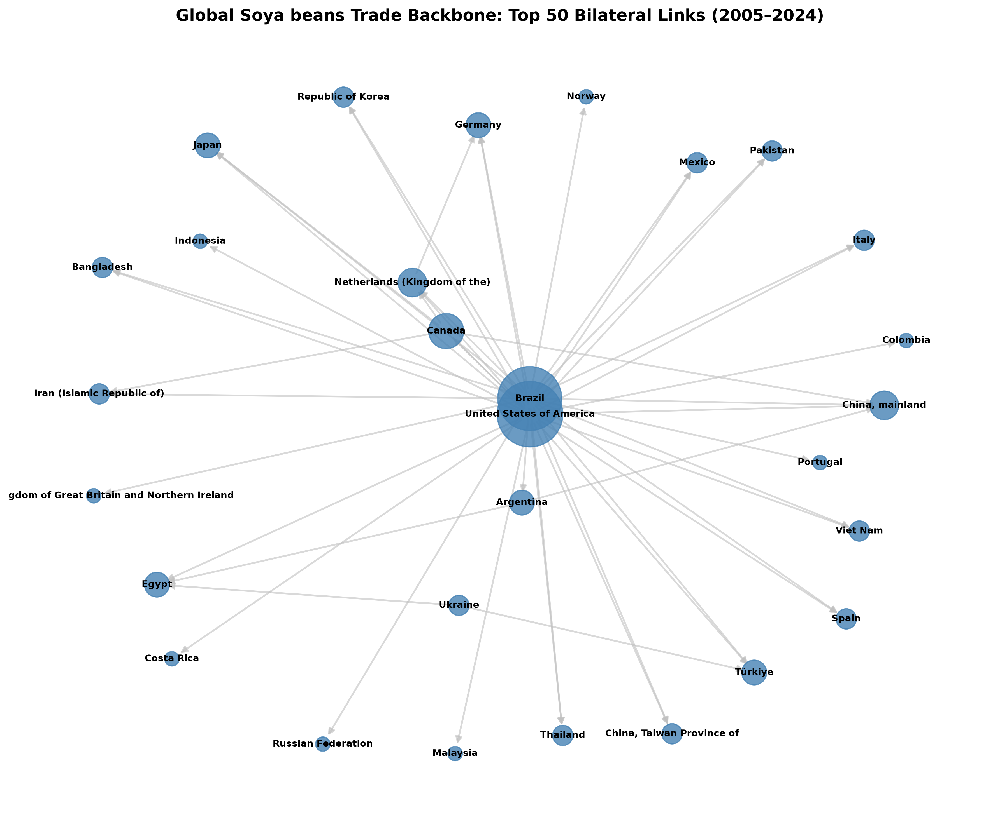

The network structure and centrality results for soya beans point to a highly concentrated global supply system. A relatively small number of exporters account for a large share of the major trade connections, creating substantial dependence on a few key suppliers.

1. Structural Backbone (2005–2024 Trade Corridors): The 50 strongest bilateral trade links form a tightly connected network centred mainly on Brazil and the United States. Both countries serve as major supply hubs, with significant export flows directed towards large markets in Asia, particularly Mainland China, as well as Europe. Argentina and Canada play smaller but still important roles within the network.

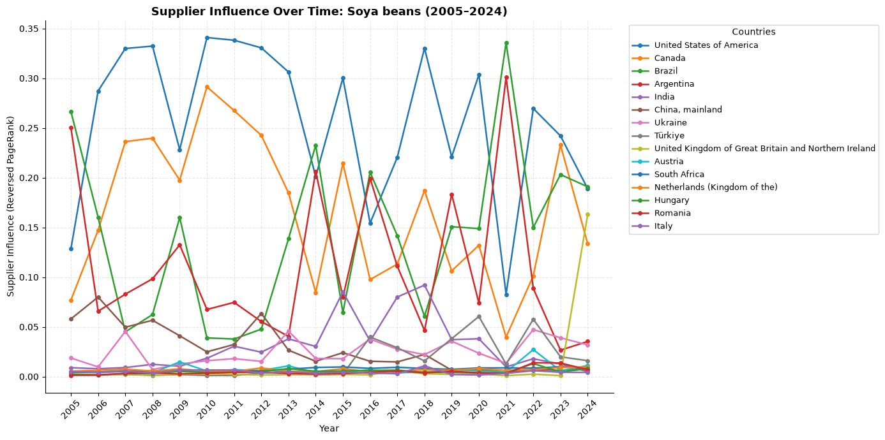

2. Systemic Centrality (Reversed PageRank): Brazil and the United States record substantially higher systemic centrality scores than other exporters. Their position in the network reflects the extent to which major importing countries depend on them for soya bean supplies. As a result, disruptions affecting either supplier could have wider effects across several downstream markets.

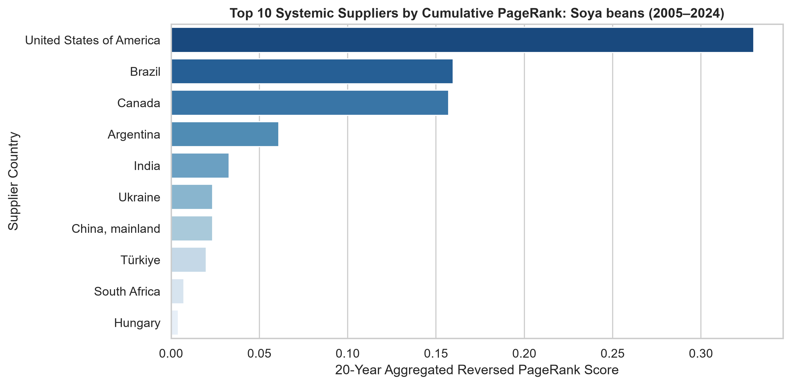

3. Timeline Trajectory: The annual PageRank results show a relatively close competition between the United States, Brazil and Canada for the most influential position in the network, with both generally falling within the 0.15–0.35 range. While the others remain considerably less central, with scores generally at or below 0.05.

# Wheat Trade Architecture

### Wheat: Network Diversification and Distributed Centrality

Wheat presents a different structure, with export influence spread across several major producing regions. Rather than depending heavily on one or two suppliers, the network contains multiple important exporters across North America, Europe, and the Black Sea region.

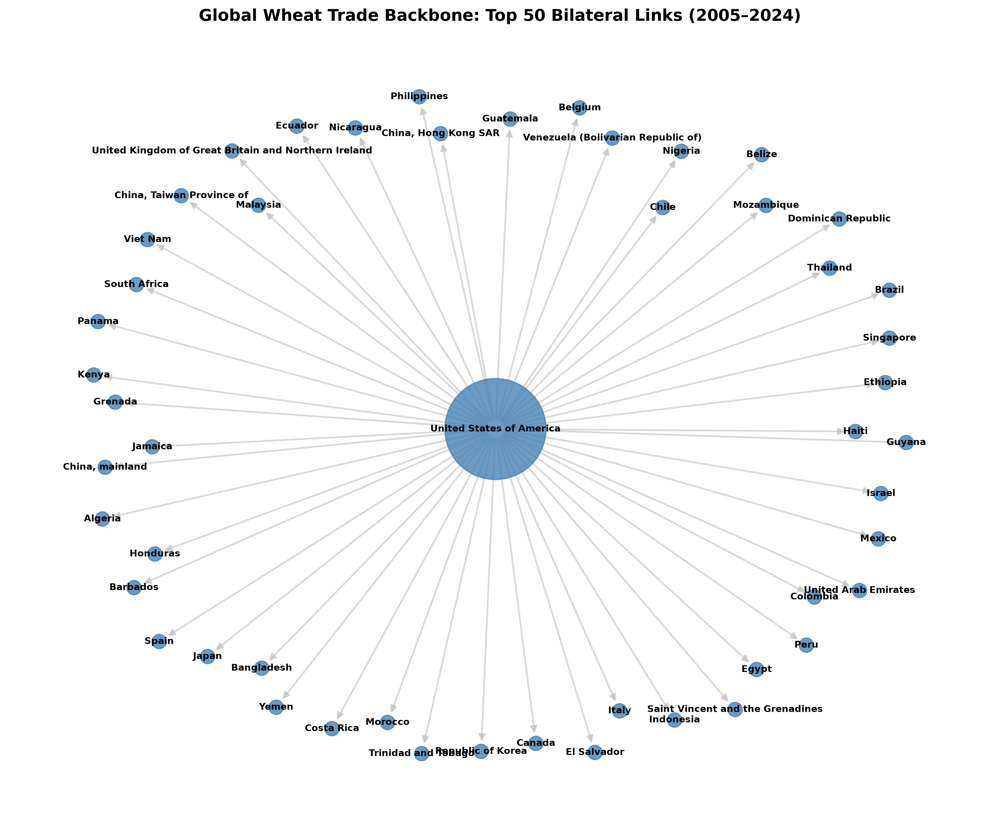

1. Structural Backbone (Top 50 Bilateral Links): The cumulative 2005–2024 network is centred strongly on the United States, which appears in many of the largest bilateral trade connections. These major export routes link the US with markets across Latin America, Asia, Africa, and Europe, giving it a prominent position in the overall trade structure.

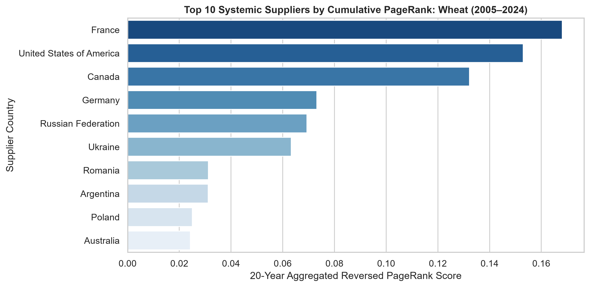 

2. Systemic Centrality (Reversed PageRank): The PageRank results present a more distributed picture of supplier importance. Although the United States accounts for many of the largest individual trade flows, France, Canada, Germany, Russia, and Ukraine also record relatively high centrality scores, ranging from approximately 0.06 to 0.17. This suggests that trade influence is not determined solely by export volume. These suppliers remain important because they are connected to a wider range of trading partners, including smaller and secondary markets that are not necessarily represented among the largest bilateral flows.

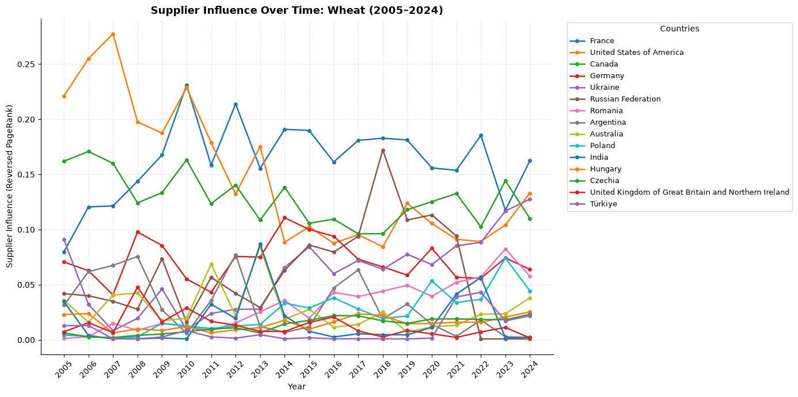

3. Timeline Trajectory: Annual PageRank scores show that the balance of influence changes over time. The United States had particularly high centrality in the earlier part of the study period, with scores above 0.25, while European and Black Sea exporters gained greater importance in subsequent years. By 2024, systemic influence was more evenly distributed across the major exporting countries.

# Rice Trade Architecture

## Rice: Regional Sub-Hubs and Shifting Centrality

Rice has one of the more varied trade structures in the dataset, with several regional hubs and noticeable changes in supplier importance over time.

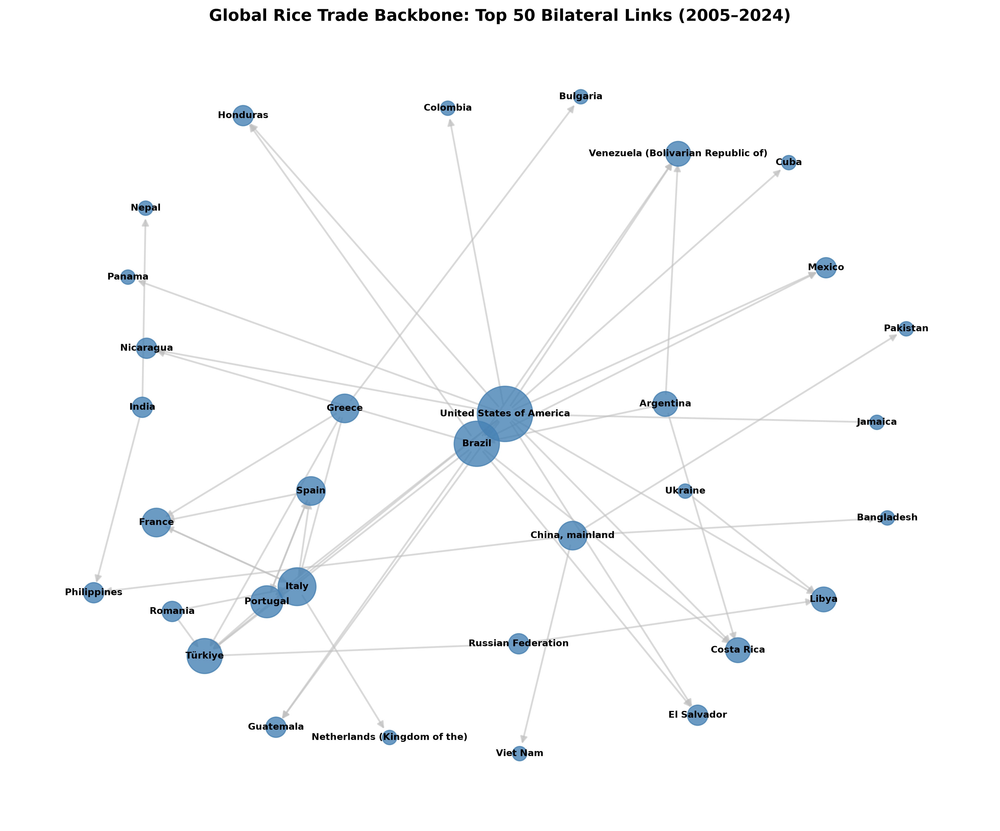

1. Structural Backbone (Top 50 Bilateral Links): The backbone network forms a multi-hub structure rather than being centred on a single exporter. The United States and Brazil account for several of the major bilateral corridors in the Americas, while European suppliers such as Italy and Spain connect strongly with markets across Europe and North Africa.

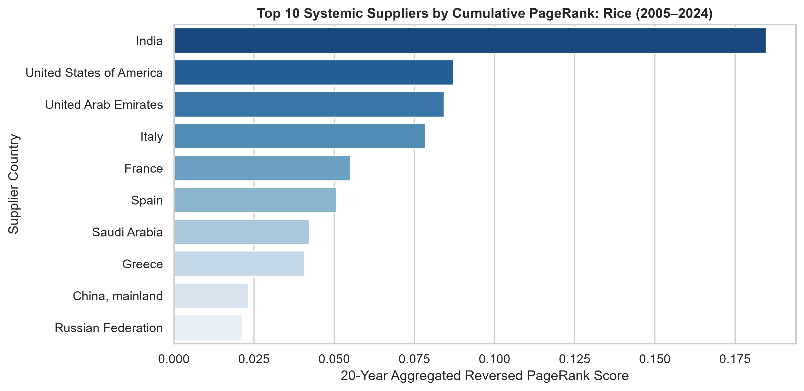

2. Systemic Centrality (Reversed PageRank): India records the highest cumulative influence over the 2005–2024 period, with a score of approximately 0.18. It is followed by the United States (approximately 0.09), the United Arab Emirates (approximately 0.085), and Italy (approximately 0.08). The relatively high position of the UAE is notable because its role reflects the importance of intermediary and re-export hubs within the rice trade network, rather than simply the volume of rice it produces.

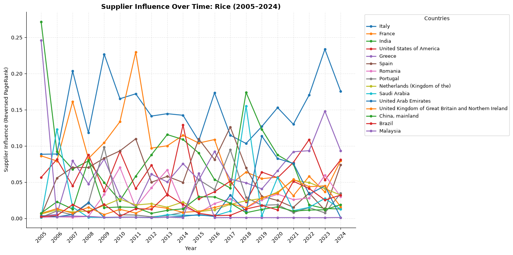

3. Timeline Trajectory: Annual PageRank scores show considerable variation in supplier influence. India records particularly high levels of centrality in 2005 and 2018, when its score exceeded 0.25. During periods when India's centrality declined, suppliers such as Italy and the United States gained a larger share of network influence. This suggests that the distribution of systemic importance within the rice network can change substantially from year to year.

# Maize Trade Architecture

## Maize: Western Hemisphere Concentration and Uneven Dependency

Maize trade is concentrated among a relatively small group of exporters, with the United States, Argentina, and Brazil accounting for much of the network's supplier influence.

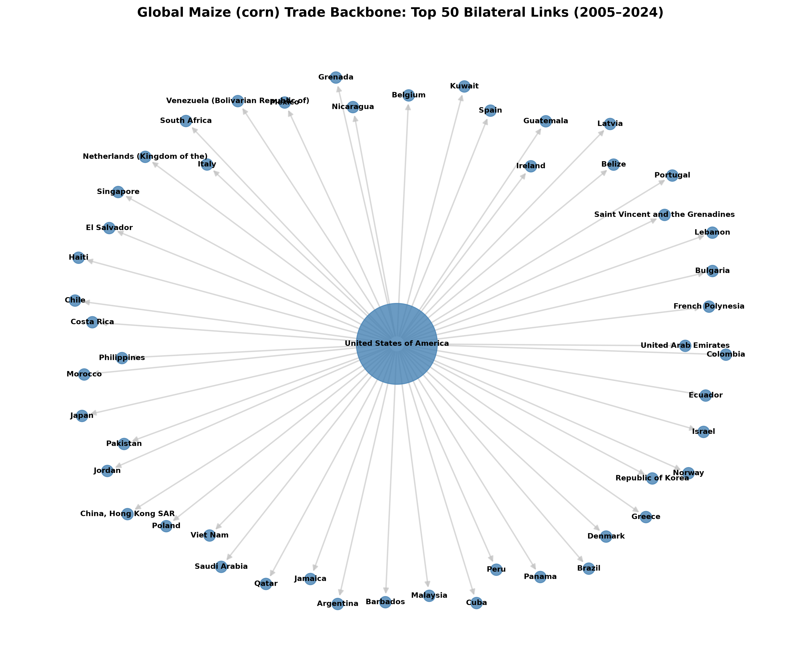

1. Structural Backbone (Top 50 Bilateral Links): The cumulative 2005–2024 network has a clear hub-and-spoke structure, with the United States occupying the most prominent position. It maintains major export connections with more than 40 destination countries across Latin America, Asia, and Europe, making it the main supplier within the backbone network.

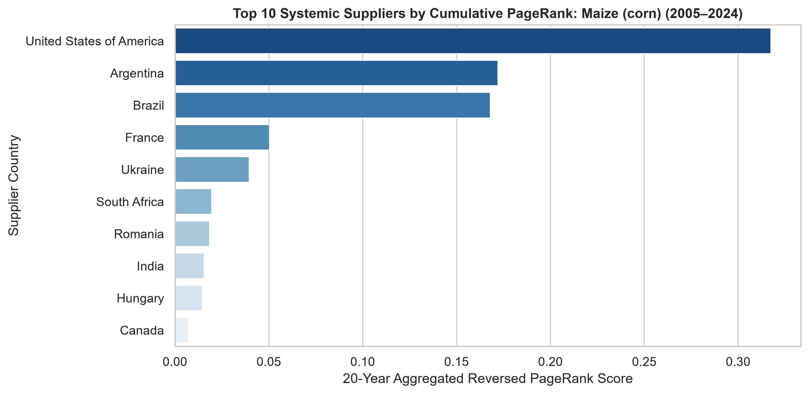

2. Systemic Centrality (Reversed PageRank): The United States has the highest Reversed PageRank score at approximately 0.33, followed by Argentina (approximately 0.17) and Brazil (approximately 0.16). Together, these three countries account for more than 65% of the network's total supplier influence. France and Ukraine have lower but still noticeable centrality scores of around 0.05–0.06.

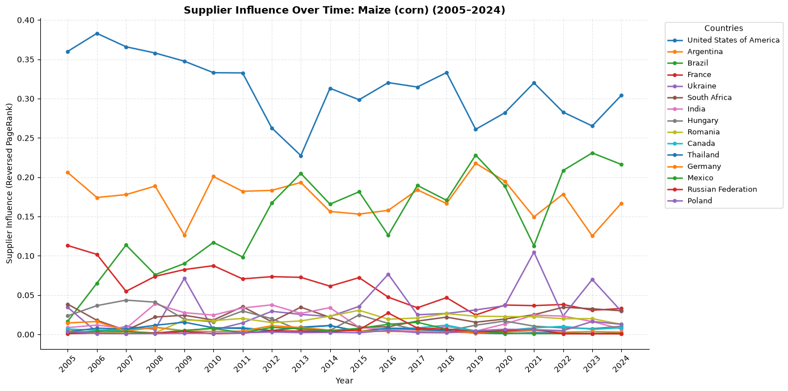

3. Timeline Trajectory: The United States remains the leading supplier in terms of PageRank centrality throughout most of the 2005–2024 period, with annual scores generally ranging from 0.23 to 0.38. Since around 2012, Brazil and Argentina have gradually increased their influence, narrowing the gap with the United States and giving the maize trade network a stronger South American presence.

# Barley Trade Architecture

## Barley: Multi-Centric Trade Structure and European Integration

Barley has one of the most decentralized trade structures in the dataset. Rather than being dominated by a single major exporter, the network is spread across several suppliers and regional trading groups, with particularly strong connections within Europe.

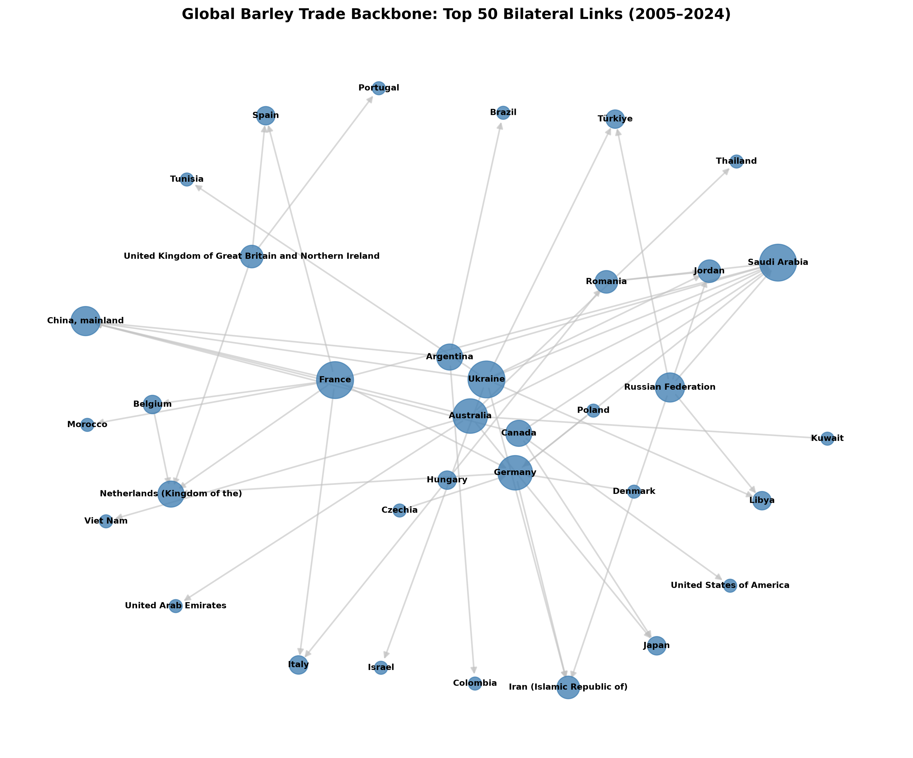

1. Structural Backbone (Top 50 Bilateral Links): The backbone forms a dense, multi-centred network with no single country dominating the main trade corridors. Western European exporters, including France, Germany, and the United Kingdom, have strong connections with neighbouring markets. Other clusters link suppliers such as Ukraine, the Russian Federation, Argentina, and Australia with buyers in the Middle East and Asia.

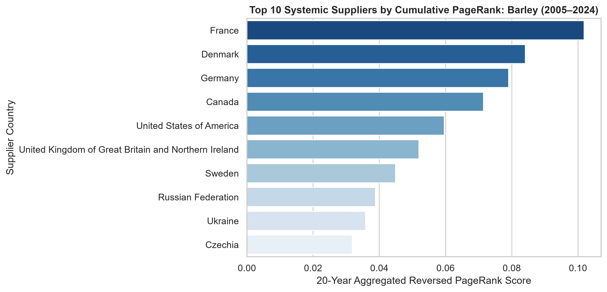

2. Systemic Centrality (Reversed PageRank): France has the highest cumulative systemic influence, with a score of approximately 0.10, followed by Denmark (approximately 0.085), Germany (approximately 0.08), Canada (approximately 0.075), and the United States (approximately 0.06). The relatively small differences between the leading suppliers indicate that systemic influence is distributed across a wider group of countries rather than concentrated in one or two exporters.

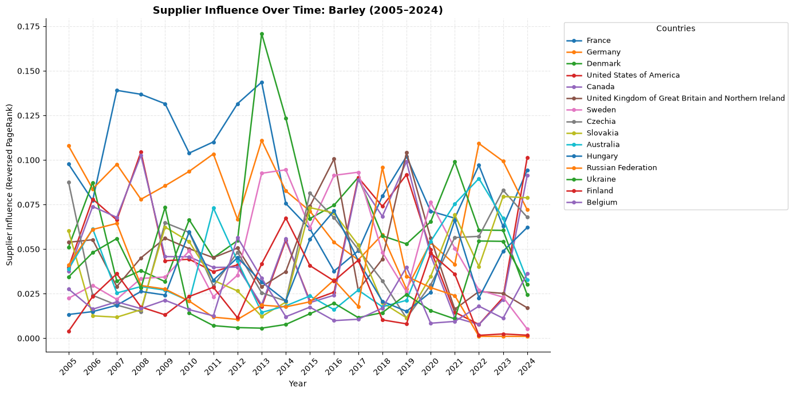

3. Timeline Trajectory: Annual Reversed PageRank scores show considerable movement among the leading suppliers, with no country maintaining a clear lead throughout the full period. France and Denmark frequently alternate between the top positions, reaching scores of approximately 0.135–0.165 at their peaks. Other regional suppliers generally remain within the 0.03–0.10 range. This distribution provides multiple alternative sources of supply, which can reduce the effect of disruptions affecting any single exporter.

## Overall Summary and Key Findings

The analysis of global trade networks from 2005 to 2024 shows that the five staple commodities do not share the same pattern of supply concentration or systemic dependence. The combination of market concentration, trade-network structure, and supplier centrality provides a more complete picture of how global food supply is organised and where potential points of vulnerability lie.

### 1. Global Food Supply Is Unevenly Distributed

The HHI results show clear differences in exporter concentration across the five commodities. Rice has the highest and most variable concentration, with HHI values reaching above 0.85 during the study period. Soya beans also show a sustained increase in concentration, rising from approximately 0.33 in 2005 to almost 0.50 in 2024. Maize remains moderately concentrated, while wheat and barley maintain comparatively lower levels of concentration.

This suggests that food-supply exposure is commodity-specific. A disruption to a major exporter would not have the same potential consequences across all five markets because the underlying supplier structures are different.

### 2. Export Volume and Systemic Importance Are Not the Same

One of the clearest findings from the network analysis is that the countries responsible for the largest individual trade flows are not always the countries with the greatest systemic importance.

The backbone networks identify the largest and most persistent bilateral trade corridors, while Reversed PageRank captures how important a supplier is within the wider network of trading relationships. This distinction is particularly clear in the wheat network, where the United States accounts for many major bilateral flows, but France, Canada, Germany, Russia, and Ukraine also maintain substantial systemic influence.

This means that assessing food-security risk purely through export volumes can overlook suppliers that play important roles across a wider set of trading relationships.

### 3. Soya Beans Represent the Strongest Case of Supplier Dependence

Among the five commodities, soya beans show one of the clearest examples of concentrated systemic influence. The backbone network is centred largely on Brazil and the United States, while the Reversed PageRank results place both countries well ahead of most other exporters.

The concentration has also increased over time, with the HHI approaching 0.50 by 2024. Taken together, these results point to a trade system in which a relatively small number of suppliers have a large influence over global availability. This makes soya beans particularly sensitive to production shocks, trade restrictions, or other disruptions affecting its main exporting countries.

### 4. Wheat Shows a More Distributed Supply Structure

Wheat presents a contrasting pattern. Its backbone network connects several major exporting regions, including North America, Western Europe, and the Black Sea region. France, the United States, Canada, Germany, Russia, and Ukraine all contribute meaningful levels of systemic influence.

The gradual distribution of PageRank scores across these countries indicates that wheat does not depend on a single dominant supplier to the same extent as some of the other commodities. Although individual exporters remain important, the presence of several major supply centres provides a broader base from which international markets can source wheat.

### 5. Rice Combines Concentration With Changing Supplier Influence

Rice displays a different form of vulnerability. Its trade network contains several regional hubs, but the HHI results show much higher levels of exporter concentration than for wheat or barley. India is the most influential supplier across the full study period, although its annual PageRank scores vary substantially over time.

The importance of the United Arab Emirates is also notable. Its position in the network illustrates that systemic importance is not limited to countries that produce the commodity themselves. Re-export and intermediary hubs can become important links between suppliers and final markets, meaning that disruptions at these nodes can affect trade beyond their own domestic production.

### 6. Maize Is Concentrated Around Three Major Suppliers

Maize falls between the highly concentrated structure observed for rice and soya beans and the more distributed structure of wheat and barley. The United States remains the dominant supplier in both the backbone and PageRank results, while Argentina and Brazil have become increasingly important.

By 2024, these three countries account for more than 65% of total supplier influence in the network. The growing role of Brazil and Argentina since around 2012 suggests that maize supply is becoming less dependent on the United States alone, although the overall network remains concentrated among a small group of exporters.

### 7. Barley Has the Most Distributed Network Structure

Barley stands out as the most decentralised of the five commodities. Its backbone network contains several regional clusters, particularly across Europe, while suppliers in the Black Sea region, North America, and the Southern Hemisphere provide additional connections.

The relatively small differences between the leading Reversed PageRank scores further support this finding. France, Denmark, Germany, Canada, and the United States all occupy important positions without one supplier consistently dominating the network. This broader distribution creates more opportunities for markets to source from alternative suppliers when disruptions occur.

### Overall Finding

Taken together, the results show that global food-security risk is shaped not only by how much a country exports, but also by how that country is positioned within the wider trade network.

Rice and soya beans present the strongest concentration concerns, although for different reasons. Rice combines high exporter concentration with substantial changes in supplier influence, while soya beans show a more persistent concentration around Brazil and the United States. Maize also depends heavily on a small group of exporters, but the growing contribution of Brazil and Argentina provides some diversification. Wheat and barley have more distributed supplier structures, with multiple countries contributing to global trade and systemic influence.

The comparison therefore highlights three distinct dimensions of food-supply vulnerability:

1. Market concentration: how much global supply is controlled by a small number of exporters.
2. Network centrality: how important a supplier is within the wider structure of international trade.
3. Network diversification: how widely supply is distributed across countries and regional trade corridors.

Considering these dimensions together provides a stronger assessment of global food-supply resilience than export volumes alone. A country may not be the largest exporter, yet still occupy a strategically important position because of the number or importance of markets that depend on it. Conversely, a highly concentrated export market may remain relatively resilient if alternative suppliers are well connected and able to absorb disruptions.

### Final Takeaway

The 2005–2024 trade networks show that there is no single global food-supply structure. Each commodity has developed its own combination of concentration, regional integration, and supplier dependence. The most important implication is therefore not simply which countries export the most, but which countries the global system has the fewest practical alternatives to.

Identifying these critical suppliers and trade structures provides a clearer basis for understanding where future disruptions could propagate across international food markets and where greater diversification of supply may strengthen resilience.
